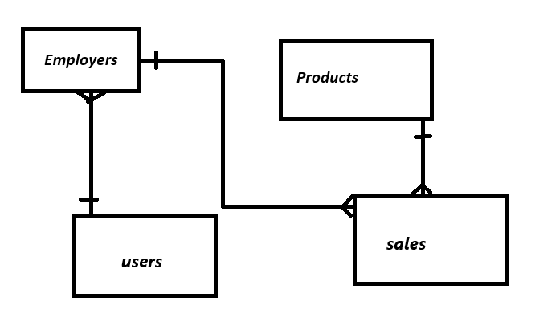

### Descripción del Proyecto
Este proyecto está diseñado para un negocio dedicado a la venta de productos de limpieza, donde cada empleado puede registrar sus ventas de manera individual. Además, es fundamental que los empleados accedan a la aplicación utilizando sus credenciales.

### Estructura de Modelos
La aplicación utiliza cuatro modelos de Mongoose que representan las colecciones necesarias para su funcionamiento:

User: Este modelo se encarga de la gestión de la autenticación y los datos de los usuarios.
Employer: Representa a los empleados que son responsables de registrar las ventas.
Products: Describe los productos que se ofrecen en el comercio.
Sales: Este modelo registra todas las ventas realizadas por los empleados.

### Diagrama E-R
